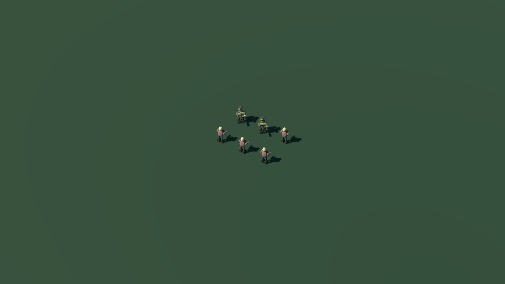
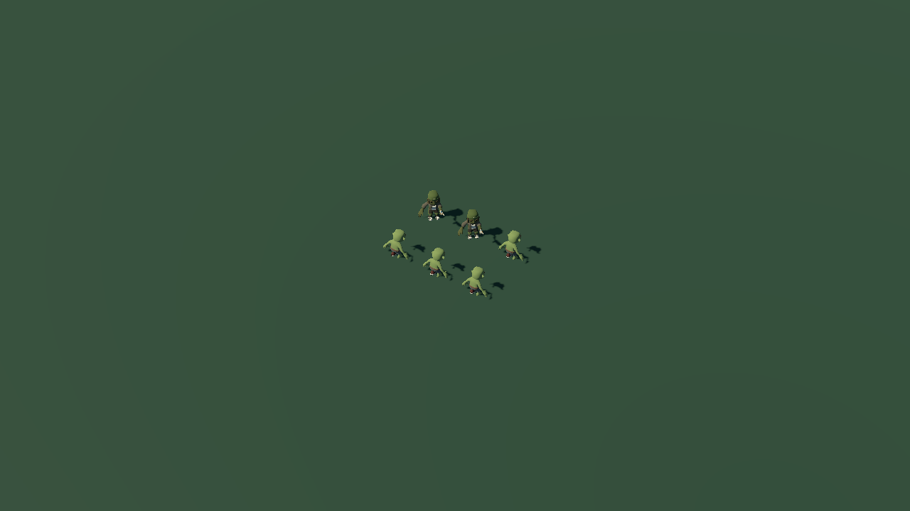
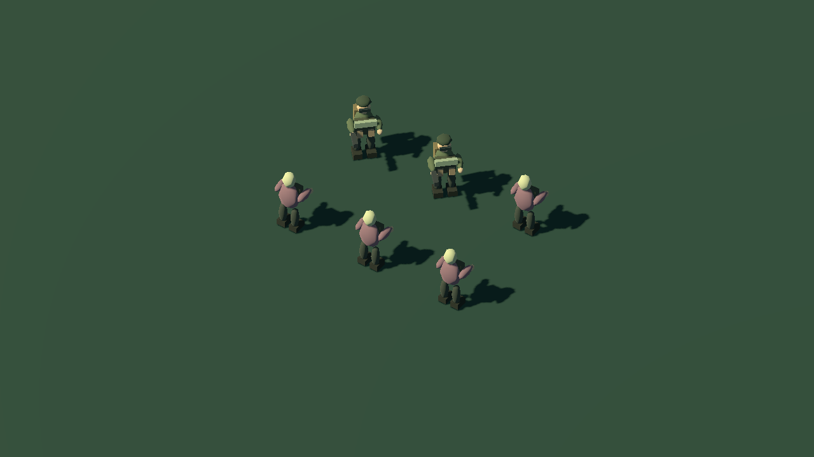
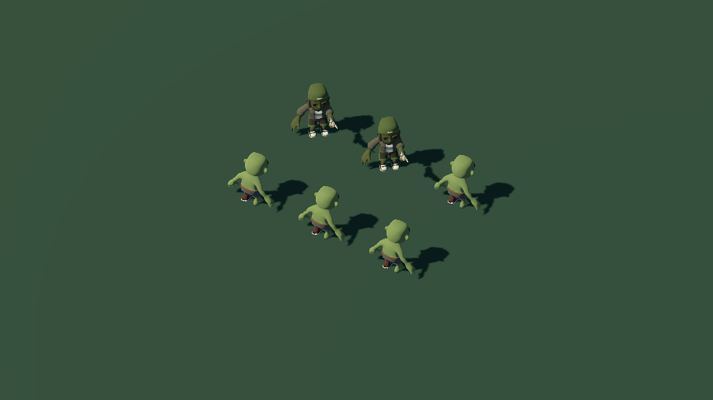

# Arte y animación — fase 1

Implementación del 5 de octubre de 2026, identificada como **arte 021**. El servidor
conserva su versión 0.20, protocolo 1 y guardado 6: esta fase no cambia las reglas
de combate. Se usó el Godot **4.5.1** instalado en `.tools`.

## Inspección inicial y reversión

Antes de reemplazar los actores se inspeccionaron `world/main.tscn`,
`world/main.gd`, `player/actor.gd`, `camera/follow.gd` y las escenas de jugador y
zombi. No había GLB, glTF, FBX ni Blend externos. Sí había un `AnimationPlayer`
con clips procedurales de quieto, carrera, apuntado, disparo, golpe y daño;
movía piezas rígidas. No había esqueleto, recarga ni muerte animada.

Los personajes usaban mallas facetadas, cajas y cilindros. El entorno,
edificios, bóveda, armas anteriores y trabajadores también se generan mediante
`world/art.gd`, `world/shapes.gd`, `building/view.gd` y otros generadores.
La sustitución de esas construcciones y del entorno pertenece a fases posteriores.

`player/player.tscn` y `zombies/zombie.tscn` comparten `player/actor.gd`; los
trabajadores se creaban con el mismo script. Ahora el agente y el zombi común
delegan su aspecto a escenas con rig. Trabajadores, resistentes y jefes
mantienen su representación anterior en la partida.

La copia inicial de los dos scripts principales y sus hashes está en
`.tools/backups/art-phase1-021/`. La copia secundaria y el test general también
tienen respaldo allí. No existía una revisión Git inicial confirmada: los
archivos del repositorio estaban sin seguimiento. Se eligió una copia explícita.
Para revertir el arte se pueden restaurar `actor.gd` y `main.gd` de esa carpeta
en ambos proyectos; los assets nuevos no son necesarios para el controlador antiguo.
El pequeño evento `death` añadido a `src/loot.mjs` es opcional para clientes
anteriores y no modifica ni el daño ni el botín.

## Escala, origen y autoridad

- El origen del actor sigue en el suelo, Y=0. El servidor usa x,y y el cliente
  los representa como x,0,z. Los modelos importados se escalan ×1,5, con altura
  aproximada de 2,2 unidades, comparable con el prototipo.
- Los archivos fuente miran hacia +Z; la escena visual gira 180° para conservar
  el frente −Z del juego. Se corrigió la inclinación del agarre de la pistola.
- Los cuerpos visuales no crean colisiones nuevas. Se mantienen los radios de
  impacto del servidor (jugador 0,75; común 0,85) y el alcance de ataque 2,3.
- Cámara ortográfica de tamaño 32 y offset (18,30,26), controles, construcción
  y partidas guardadas conservados. Las capturas de detalle usan tamaño 14,
  igual en el antes y el después; no se cambió el zoom jugable.

## Modelos y licencia

**Quaternius, Zombie Apocalypse Kit, CC0 1.0.** La licencia se verificó en la
[página del autor](https://quaternius.com/packs/zombieapocalypsekit.html).
Drive tenía la cuota agotada; se descargaron copias identificadas del mismo
paquete desde un espejo fijado a un commit. Los enlaces, nombres originales y
adaptaciones están en [LICENSE.md](../assets-source/characters/LICENSE.md).

| Asset | Triángulos fuente | Huesos | Animaciones fuente |
|---|---:|---:|---:|
| Sam + pistola | 10.292 | 43 | 20 |
| Zombie Basic | 7.822 | 50 | 16 |

Se conservan fuentes glTF autocontenidas en `assets-source/characters/` y los
GLB en `assets/characters/` de los dos proyectos. Las importaciones generan
LOD y mallas para sombras; texturas y bibliotecas de animación se reutilizan.
`cerco_palette.gdshader` convierte el casco amarillo en oliva y reduce la
saturación, manteniendo las variantes cosméticas del uniforme.

No se encontró Blender en las instalaciones habituales. Se utilizó la ruta
de assets externos autorizada, sin atribuirse el modelado ni entregar .blend
de autoría inexistente. Los modelos no son arte exclusivo de El Cerco; la
paleta, integración y animaciones adicionales sí están adaptadas al juego.

## Animaciones implementadas

- Agente: quieto/apuntado, caminar, correr, retroceder, desplazamiento lateral,
  disparo con retroceso y destello, recarga, daño, muerte y reaparición.
- Zombi común: quieto, caminar/perseguir, carrera para la variante corredor,
  ataque, daño y muerte. El resistente conserva su geometría hasta la fase 2.
- Dos `AnimationPlayer` separan piernas y torso. El disparo y la recarga no
  detienen la zancada. `stride_modifier.gd` gira cadenas completas y conserva
  la pose del torso; no cambia longitudes de huesos.
- El gesto de recarga aproxima ambas manos a la pistola con una resolución de
  dos huesos al crear los fotogramas. No hay simulación física del cargador.
- El daño del servidor es instantáneo cuando `attack` vuelve a 1. El cliente
  representa el contacto en el segundo 0,38 del clip y reproduce la recuperación;
  no retrasa ni repite el daño. No se añadió una preparación de ataque al servidor.
  La latencia de red sigue separando el evento del servidor de su presentación.
- Un evento temporal `death` permite animar incluso enemigos resucitados sin
  convertirlos en cadáveres reutilizables. Un zombi muerto permanece visualmente
  1,8 segundos y se libera; salir/cambiar de mundo limpia esas representaciones.

## Pruebas realizadas

1. **119/119 pruebas Node** y `npm run check` aprobados. El nuevo caso comprueba
   que muerte repetida no duplica evento, botín ni cadáver resucitable.
2. Prueba general nativa aprobada en **ambas carpetas**: movimiento, combate,
   recargas repetidas, construcción, herramienta, recolección, red, reconexión y
   lectura posterior del guardado temporal.
3. `verify-art.mjs`: dos clientes HTTP/SSE con dos instancias de la escena
   principal. La segunda usa un SubViewport propio; no son dos equipos remotos.
   Ocho direcciones replicadas, pistola alineada, escala de piernas conservada,
   disparo mientras camina, recarga sin reinicios por snapshots, persecución,
   daño, muerte, liberación del cadáver y reaparición: **cero fallos** en ambos
   proyectos. Dos contactos causaron dos animaciones y exactamente 18 de daño.
4. Capturas reales revisadas de recarga, ataque, muerte y juego conectado.
   El clip usa estados de prueba deterministas y está rotulado como demostración;
   las pruebas de combate son independientes y usan el servidor real.

Informes: `art-021-native.txt`, `art-021-combat.txt`,
`art-021-secondary-native.txt`, `art-021-secondary-combat.txt`.

### Rendimiento medido

RX 580 2048SP, Compatibility, 1280×720, vsync desactivado y límite 144 FPS.

| Escenario | FPS medios | p95 por fotograma |
|---|---:|---:|
| Dos clientes, tres infectados, cinco construcciones | 144,28 | 7,03 ms |
| 96 infectados, 80 muros y 32 residentes | 117,02 | 10,65 ms |

La carga ampliada es **renderizado estático con animaciones de reposo**, sin IA
para las entidades añadidas. No certifica +60 FPS en todos los equipos, con
40 jugadores reales, ni durante una campaña completa. Reportes:
`performance-art-021.json` y `performance-art-021-stress.json`.

## Evidencia visual

Misma cámara y posiciones en una muestra dentro de la escena principal:




Detalle, mismo ángulo y tamaño 14:




[Clip AVI de 13 segundos](art-021-animations.avi) ·
[Partida con servidor real](art-021-live.png) ·
[Muerte en combate](art-021-death.png).

## Archivos de implementación

En **ambas** carpetas Godot:

- `assets/characters/Sam.glb`, `Zombie.glb`, atlas PNG e importaciones.
- `assets/characters/cerco_palette.gdshader`.
- `player/agent_visual.tscn`, `zombies/common_visual.tscn`.
- `player/rig_visual.gd`, `player/stride_modifier.gd`, `player/actor.gd`.
- `world/main.gd`: selección del modelo, retiro de cadáveres y registro de
  controles idempotente al instanciar una segunda escena.
- `tests/art_smoke.gd`, `art_comparison.gd`, `art_showcase.gd` y salida de
  reportes de `tests/native_smoke.gd`.

Compartidos: `src/loot.mjs`, `test/art-events.test.mjs`,
`tools/pack-characters.mjs`, `tools/verify-art.mjs`, `tools/capture-art.mjs`,
fuentes/licencia en `assets-source/characters/` y documentación.

## Reproducir

```powershell
$engine = '.tools/godot-4.5.1/Godot_v4.5.1-stable_win64_console.exe'
node tools/verify-art.mjs $engine --capture
node tools/verify-art.mjs $engine '--project=el-cerco-3d-(4.5)'
node tools/verify-godot.mjs $engine --capture --stress
node tools/capture-art.mjs $engine --compare
node tools/capture-art.mjs $engine
```

Los lanzadores de pruebas crean servidores y guardados temporales propios.
Para probar jugando, cerrar y volver a abrir Godot tras importar los assets;
si el servidor estaba abierto antes del cambio, reiniciarlo para recibir el
evento visual de muerte de enemigos resucitados. No borrar las partidas.

## Pendiente de aprobación

Revisión humana del estilo y sensación de juego. La fase 2 incorporará el
zombi resistente, una bóveda identificable y tres piezas de base. Después se
abordarán la zona de muestra, iluminación e interfaz en la fase 3.
