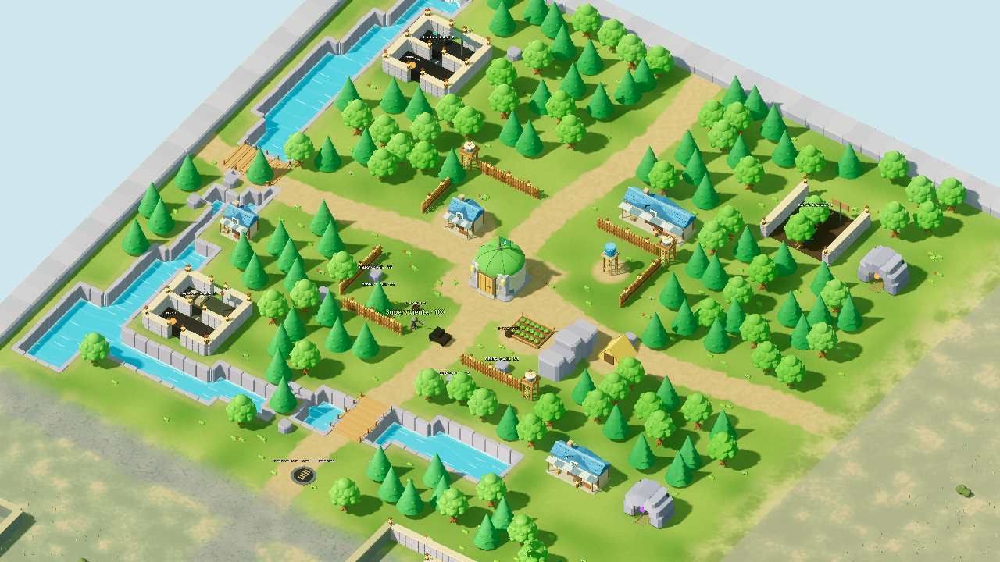

# Bosque cartoon

Recreación 3D de la referencia del bosque en las dos copias Godot. Incluye árboles con copas de varias capas, núcleo con cúpula segmentada, mampostería y bandera, senderos de tierra, agua turquesa animada con orillas profundas, dos puentes con tablones y cuerdas, rocas biseladas, empalizada y torres de madera. Las casas tienen tejas individuales, toldos, ventanas, chimeneas y cajas; los patios existentes tienen paredes de piedra y faroles.

La captura se genera con la escena real y un mundo en memoria. El comando de captura lee el guardado sin escribirlo; cuando no existe una comunidad del bosque válida, utiliza un mundo nuevo de prueba. No añade edificios falsos para la captura.

## Alcance y límites

- No se añaden tipos de recursos, producción, recetas ni entradas al catálogo de edificios.
- La vegetación ambiental, la empalizada, las torres y los modelos de taller, huerto, depósito, tienda y cuevas son escenografía fija. Sus obstáculos se comparten con el servidor para movimiento, disparos y construcción. No tienen producción ni añaden entradas al catálogo. Los arbustos, flores, hierba y troncos pequeños son decoración transitable.
- La parcela central y cuatro entradas amplias permanecen libres. En guardados existentes se omiten segmentos ocupados por personas, recursos o edificios; por eso el cerco puede contener huecos adicionales.
- El río tiene agua a 2,2 metros por debajo del suelo y obstáculos autoritativos. Los dos cruces permanecen transitables a nivel del suelo. No se implementa natación; las cuevas son decorativas. En guardados existentes se evitan los objetos ocupados, lo que puede crear islas adicionales.
- El núcleo amplía su escala cuando su entorno está libre. Su radio se comparte con movimiento, construcción y alcance de ataque; si hay ocupantes o construcciones cerca conserva la huella original.
- Es una interpretación procedural del diseño, no una reproducción idéntica de la ilustración: quedan diferencias en relieve, proporciones y detalle artístico. Los personajes mantienen sus modelos actuales.
- Los otros biomas conservan su distribución y modelos. La conversión de colores a espacio lineal corrige los materiales compartidos. El cambio visual se integra en Godot; el cliente web no reproduce estos modelos nuevos.
- Ambas copias usan Forward+ para oclusión ambiental, brillo y sombras suaves. El dispositivo de la captura es una GeForce GTX 1660 SUPER con Vulkan. El ajuste móvil conserva Compatibility como alternativa.

## Abrir y verificar

Iniciar el servidor con `node tools/start-godot.mjs` y volver a ejecutar el juego en Godot. Un servidor que ya estuviera abierto necesita reiniciarse para cargar la escenografía nueva. La escena genera la distribución ambiental una vez y la guarda con el mundo; no mueve objetos guardados.

Captura reproducible: `node tools/capture-forest.mjs RUTA_GODOT`.

Validación: 123 pruebas Node y comprobación nativa de movimiento, combate, construcción, recolección, persistencia y reconexión en ambas carpetas Godot. Capturas renderizadas con Godot 4.7.2 y Forward+. La captura mide unos 151 fps durante 40 fotogramas con la cámara cercana y la escena estática; no constituye una prueba de rendimiento de una partida con muchas entidades.
