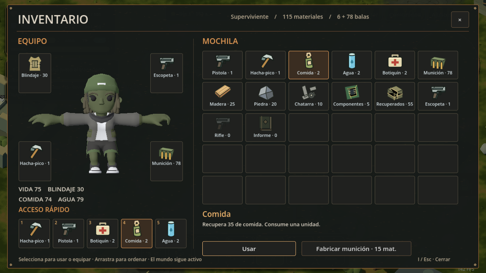

# Inventario Supervivencia

Implementación del 7 de octubre de 2026 en `godot` y `el-cerco-3d-(4.5)`.

## Uso

- Pulsa **I** o el icono de mochila del lateral derecho para abrir. **I**, **Esc** o **×** cierran.
- Selecciona una casilla para consultar el objeto y usarlo, equiparlo o recargar.
- Los accesos inferiores funcionan con clic o **1–5 mientras el inventario está abierto**: hacha-pico, pistola, botiquín, comida y agua.
- Arrastra una casilla a otra para intercambiar posiciones. El orden se guarda por identidad en `user://inventory_layout.cfg`.
- Fabricar munición consume 15 materiales y usa la receta del servidor: 18 balas fuera del taller, con bonificación dentro de uno.
- Escopeta y rifle muestran sus recetas. El servidor exige taller, materiales y componentes para fabricarlos. Las armas ya adquiridas se pueden equipar sin volver a pagar.

La vista muestra cantidades reales de suministros, munición, cinco tipos de materiales, armas adquiridas, blindaje e informe de expedición. Las casillas atenuadas indican existencias cero o armas todavía sin fabricar. El modelo Sam y su paleta cosmética se muestran en un SubViewport independiente; la pose en T se obtiene rotando los brazos de esa instancia.

## Reglas y alcance

El servidor conserva la autoridad sobre uso, fabricación, recarga y equipo. El inventario se actualiza desde los snapshots y no modifica recursos localmente. Los recursos siguen disponibles para construcción, almacenamiento y expediciones.

Abrir el panel bloquea movimiento, disparo y construcción; cancela el plano y las órdenes de selección. La simulación sigue activa. **P** conserva la pausa existente. Muerte, desconexión y salida cierran el inventario; diario, comunidad y ajustes cierran la mochila al abrirse.

Las 30 casillas organizan los tipos de recursos existentes. No introducen un límite de peso ni capacidad de carga en el servidor. Blindaje es la protección actual; casco y ropa forman parte del modelo existente. El equipo independiente de prendas, dividir pilas y tirar objetos al suelo quedan fuera de esta implementación.

## Validación

- `npm test`: 119 pruebas aprobadas.
- `npm run check`: aprobado.
- `node tools/verify-inventory.mjs RUTA_GODOT`: prueba con servidor temporal y cliente Godot real.
- Segundo proyecto: añade `"el-cerco-3d-(4.5)"` como último argumento.

La prueba comprueba clic en la mochila, I/Esc, bloqueo de controles, consumo con cambio de cantidad y necesidad, equipamiento, recarga, coste y producción de munición, rechazo de fabricación sin taller, organización y guardado, límites por existencias/vida/pausa, tamaño de ventana, transición al diario y cierre por muerte. Genera la captura con recursos sembrados únicamente en el mundo temporal de prueba.

Reinicia la ejecución del juego en Godot para cargar la interfaz nueva. Usa el servidor habitual; las partidas existentes conservan sus recursos y reglas.
